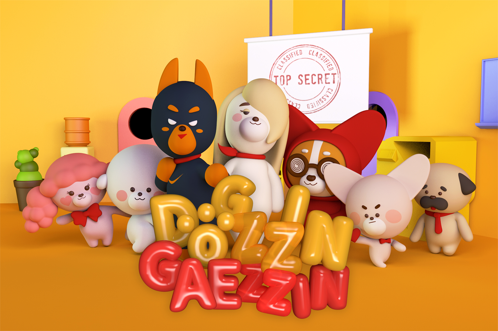
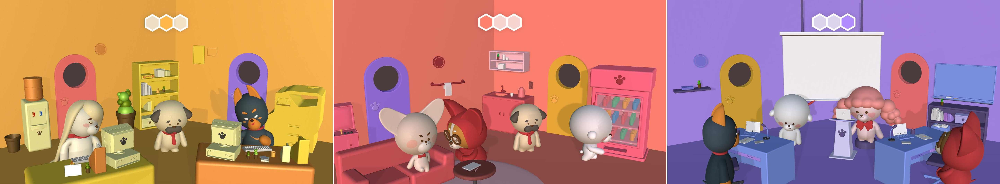
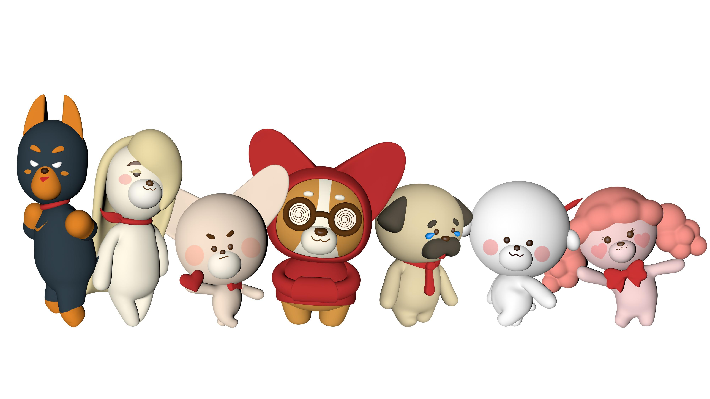
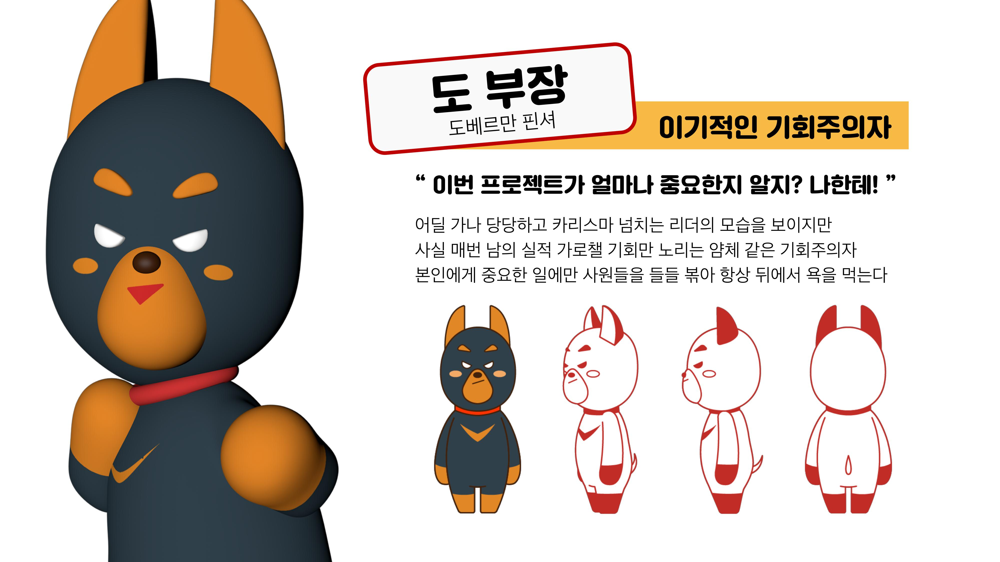
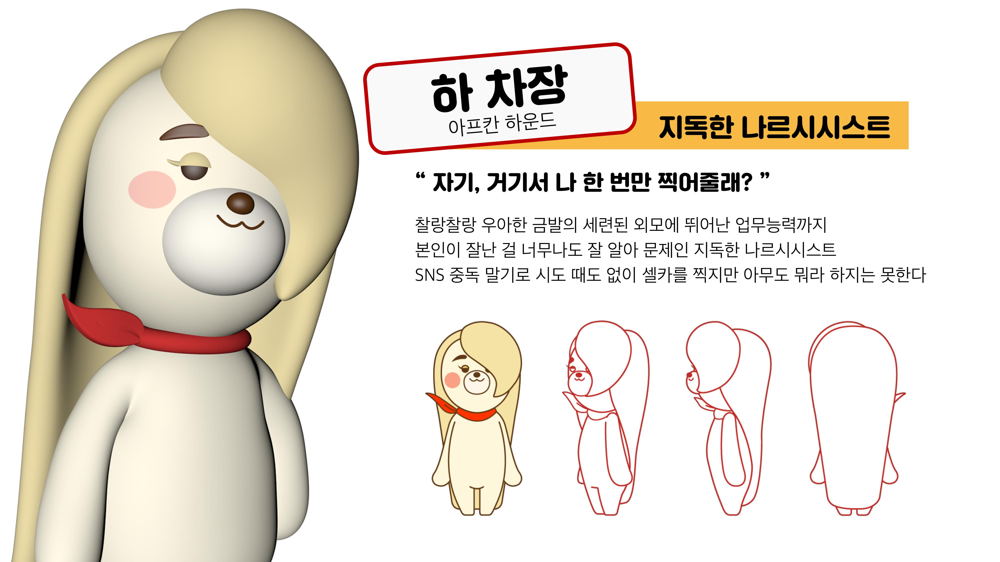
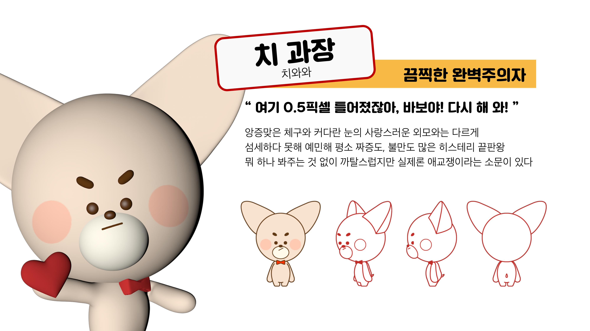
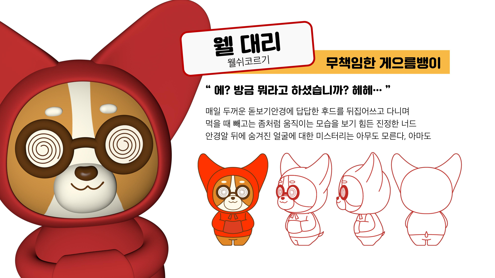
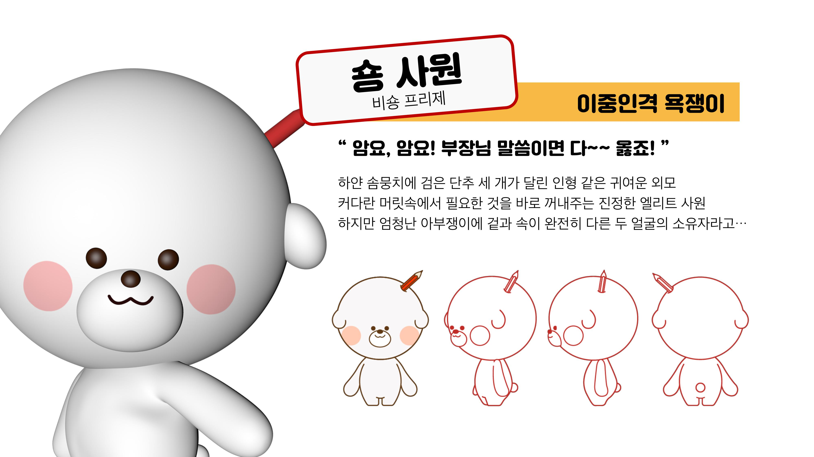
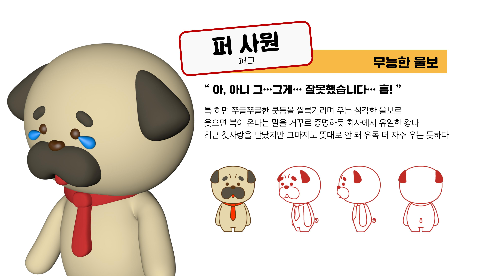
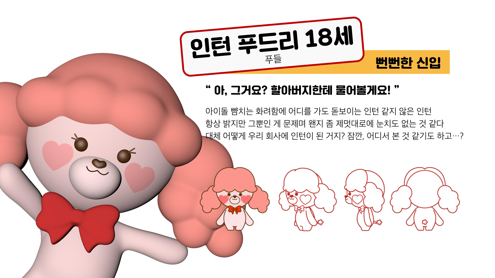

# Welcome to DOGGAEZZIN CORPORATION!
 
What if your work colleagues who were insulting like "dogs" everyday 
become a real dog?  
Here are dogs of DOGGAZZIN CORPORATION that will make you really 
annoyed!  
하루가 멀다하고 매일 '개'같다 욕하던 당신의 직장 동료들이 진짜 개가 되어 
버린다면?  
여기 진짜 '개' 같은 개들만 모인 주식회사 '독찐개찐'이 있다!   

 
This is character Promotion Exhibition based on the world view of <Company life with people like 'dog' except for me>.  
If you want to see how it is implemented, please contact us by personal 
mail. Please refer to the bottom of the email address  
I want to share all the files, but I will upload only the executable file because it is not my personal project.  
Go to the first link below to download the executable file and go to the second link below to view the video.  
이것은 <나 빼고 다 '개'같은 사람들과의 회사 생활>에 대한 세계관을 기반으로 한 캐릭터 프로모션 전시 콘텐츠 입니다. 
어떻게 만들었는지 궁금하다면 개인 메일로 문의주세요. 메일주소는 맨 하단을 참고하세요.  
모든 파일을 공유하고 싶지만 개인 프로젝트가 아니므로 실행파일만 올리겠습니다.  
실행 파일을 다운로드하려면 아래 첫 번째 링크로 이동하시고 영상을 확인하시려면 아래 두번째 링크로 이동하세요  
[Download link] https://drive.google.com/drive/folders/1s2v4pu5d94-CJJsJKfYByo5D30Q_QBTc?usp=sharing  
[Video link] https://youtu.be/ytiMBGMbHWQ   

If your device is based on the Windows operating system, just download 
it! But before you install it, please check 3 things.  
one, check the number of operating system bits in your computer.  
two, Unzip the downloaded file before running the file.  
three, Check the screen resolution and make the graphics quality ultra.  
당신의 컴퓨터가 윈도우 기반이라면 설치하세요! 그러나 설치 전에 유의할 3가지 사항이 있습니다.  
하나, 당신의 컴퓨터 운영체제 비트수를 확인하세요.  
둘, 실행 전에 다운로드 받은 파일의 압축을 해제하세요.  
셋, 컴퓨터 해상도를 확인하고 그래픽 품질을 최상으로 해주세요.   

It's easy, is not it?  
참 쉽지 않나요?   

# Company employees in DOGGAZZIN 
We introduce our lovely(?) seven characters.  
우리들의 사랑스러운(?) 7마리 캐릭터를 소개합니다.  
  

 
 
 
 
 
 
 

# These are the members who made this company.
[기획자/PM]  
이주원(Lee-Ju-won) dont_bother_me@naver.com   
[디자이너/Designer]  
박새미(Park-Sang-Mi) dlfdydlfdlwh@naver.com / 윤지은(Yun-Ji-Eun) 
ableft7545@naver.com / 이연우(Lee-Yeon-Woo) annafox95@naver.com 
  
[개발자/SW Enginner]  
송혜미(Song-Hye-mi) workinghamee@gmail.com <- It's Me!   
